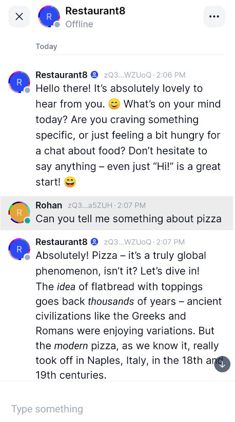
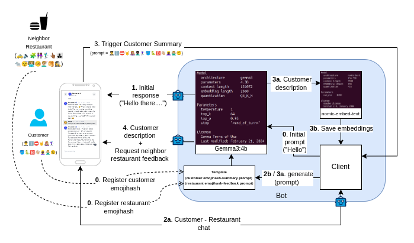
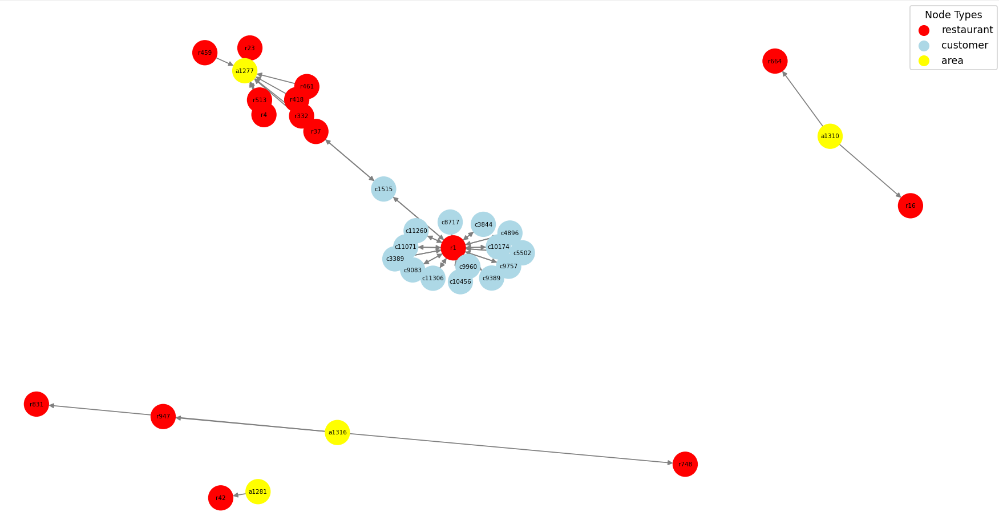
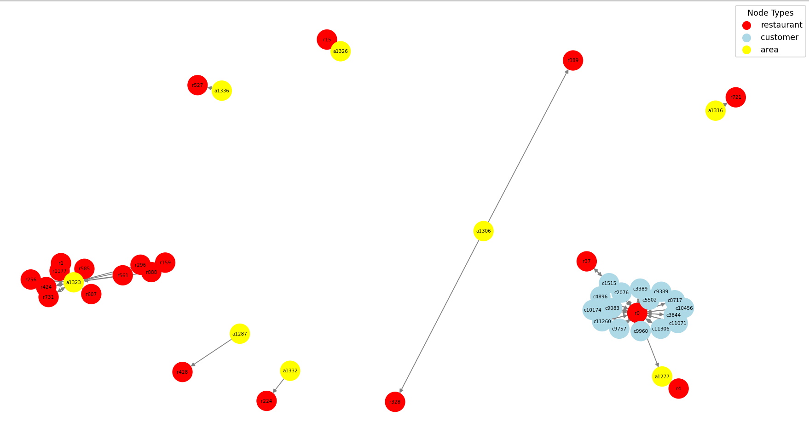
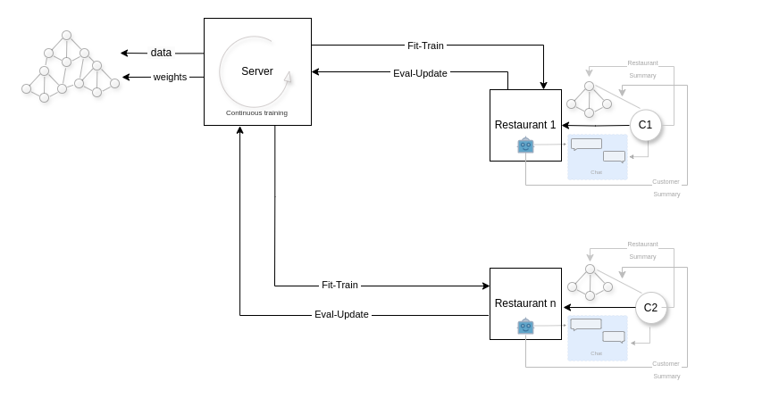
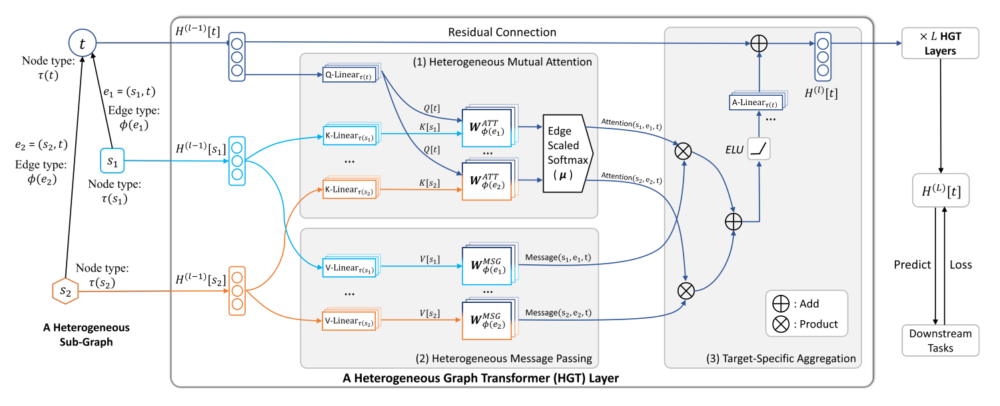
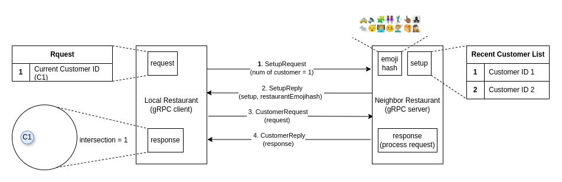

# Restaurant-FL
## An automated Restaurant success prediction model (federated learning) using natural language based unstructured feature extraction and heterogeneous graph transformers to capture high-order interactions between restaurants, customers and locality.

Traditional restaurant success prediction models rely on restaurant datasets with fixed features like food type, ratings etc and a bunch of customer statistics like food preference, avg spend, demographic etc usually queried as a feedback questionnaire with multiple choice answers.

What if a rich unstructured feature set can be captured through the medium of a fun natural conversation with the customer about the current dish, the restaurant menu, the customers liking's and cravings, a brief history about the cuisine, any suggestions about the restaurant service etc. while making the conversational friendly, knowledgeable and free flowing.

Introducing the restaurant's in-house friendly culinary expert, an efficient and light-weight personality that can answer questions about the restaurant, food facts, cuisine, food culture, basically anything about food.

Don't worry its just a Bot ([gemma3:4b](https://ollama.com/library/gemma3)) that runs locally on the restaurant's PoS machine with the following system prompt
```
You are a friendly culinary expert with knowledge of food,
cooking techniques, regional cuisines, and global food culture.
You engage users in short but insightful, enjoyable conversations
about food, sharing recipes, ingredient tips, historical context,
modern trends and cooking wisdom.
You are enthusiastic, warm, and intelligent but is also considerate
of the user's time.
```



Customers are usually reluctant to provide feedback or honest opinions because they lack incentive to do so, this is where a natural non-pushy conversation can spark a drive to gain knowledge and facts about food. Additionally a small percentage of the price can be waived by the restaurant adding economic incentive. Keeping the identities anonymous can also help with the indulgence in the chat. In general storing data locally and not on server farms helps increase confidence. Also providing feedback of a recent but different restaurant visit can encourage a much honest review.

## Using Docker

```
   sudo docker run --env-file .env --network host --rm -v $HOME/.cache/tastebot:/root/.cache/tastebot tastebot:1.1.0
```

##    OR

## Manually

### Install Dependencies

1. Install Poetry
```
   curl -sSL https://install.python-poetry.org | python3 -
```

2. Install git lfs

```
   curl -s https://packagecloud.io/install/repositories/github/git-lfs/script.deb.sh | sudo bash && sudo apt install git-lfs
```

3. Install Go 1.23.0
   
   Visit https://go.dev/dl/
   
   Download the Linux tarball (e.g., go1.23.0.linux-amd64.tar.gz).

```
    rm -rf /usr/local/go && tar -C /usr/local -xzf go1.23.0.linux-amd64.tar.gz
```

4. Install build tools

```
   sudo apt-get install build-essential cmake m4 automake peg libtool autoconf
```

### Install TasteBot

1. Clone the repository
```
   git clone --recurse-submodules https://github.com/boscojacinto/Restaurant-FL.git && cd Restaurant-FL
```

2. Build and install TasteBot
```
   poetry install
```

3. Run TasteBot Server (in a separate terminal)
```
   poetry run server
```

4. Run TasteBot Neighbor Restaurant (in a separate terminal)
```
   poetry run neighbor
```

5. Run TasteBot Client (in a separate terminal)
```
   poetry run client
```

## Customer Pairing with Restaurant (QR code and status-im app)

1. Install the status-im app
   [Status-IM messenger](https://play.google.com/store/apps/details?id=im.status.ethereum)

2. Scan the QR code of the Restaurant
   
   https://youtu.be/mU189Dj4QWo

## Requirements.

## For the Bot the following points served as a fundamental requirements for the design.
---
1. The Bot should run locally on the current restaurant PoS.
	#### After a lot of experimentation we observed gemma3:4b has the right balance of capability and performance (currently tool calling doesn not work). We used ollama to serve multiple instances (currently 4 simultaneous chats) 
2. The system should integrate with web3 for token incentives.
	#### Will be done in the future preferrably with native tokens on an L2 with order proofs
3. The chat should be decentralized with complete anonymity.
	#### We integrated with Status-IM p2p messanger which uses waku protocol. The customers' emojihash(identifier) is used by the customer trigger the summary of the customers description and the neighbor restaurant's emojihash(identifier) is used to summarize the customer's feedback and end the chat
4. The system should store customer ids and features in a local db.
	#### We store the customer and restaurant features as embeddings genrated form a short description (bot is prompted for the description at the end of the conversation) using an embedding model (nomic-embed-text) server locally on ollama



## For the training of the Restaurant prediction model the following were our requirements
---
1. Since the customer and restaurant insights do not leave the restaurant PoS 
   system, hence the model needs to train locally.
   #### The restaurant trains on the local dataset of customer and neighboring restaurants

2. The model should learn first-order interaction between the customer, the 
   local restaurant and the neighboring restaurants from its local training.

3. The model should learn higher-order interaction between restaurants, areas,
   localities and customers as a result of the aggregation of the weights from the local graphs.
   #### We used federated learning using Flower AI's framework to train the local graph on individual restaurant machines and then use FedAvg to aggregate the local train weights to update the global model and global graph with all the restaurants, customers and area features and edges

4. The federated client should be able to integrate with the rest of the 
   workflows (status-im chat client, bot client)
   #### Flowerai only has a CLI to interact with, but since the code is open-source we made a couple minor modifications to integrate the apis with our runtime [Is it possible to attach (long running) business logic in the long running SuperNode process?](https://discuss.flower.ai/t/is-it-possible-to-attach-long-running-business-logic-in-the-long-running-supernode-process/913) 

 
## For the Restaurant dataset design, the following were the considerations
---
1. There should be a global restaurant dataset(country-wide) with basic 
   features like restaurant name, city, area. This dataset should be converted to a global heterogeneous graph with restaurant nodes, area nodes and placeholder customer nodes.
   #### We used a publicly available [Swiggy Dataset Restaurants](https://www.kaggle.com/datasets/abhijitdahatonde/swiggy-restuarant-dataset) and converted it to a city-wide graph of type [pyG HeteroData](https://pytorch-geometric.readthedocs.io/en/latest/generated/torch_geometric.data.HeteroData.html) called SWGDataset

2. The local restaurant data should be a subgraph of the global graph which
   will be created when the restaurant is selected for training by the Flower FL framework. The subgraph should contain the restaurant node under subject and also the neighbouring restaurant nodes (same area).

3. The local graph should add customer nodes, its edges to the restaurant
   and its edges to neighboring restaurants as determined by the outcome of the
   conversation of the customer with the Bot. The customer features and the neighbour restaurant feature should also be added to the respective nodes in the graph.
   #### We currently store the normalized customer and restaurant embeddings extracted from the conversation and create a subgraph dataset of type SWGDatasetLocal which is then used by the FL train, eval workflow 

|  |  |
|----------------------------------------------------|----------------------------------------------------|




## For the Restaurant success prediction model, the following were the considerations
---
1. The model should be a graph convolution neural network(GNN) so as to utilize 
   the spatial features of the nodes (restaurant and customers).
   #### We came across a reference design [Restaurant Success Prediction](https://medium.com/restaurant-success-prediction/restaurant-success-prediction-4809efe09203) but it consisted of only restaurant nodes (homogeneous graph) and general restaurant reviews(yelp, facebook) and also had a correlated data problem (number of reviews <--> number of positive reviews) as highlited by the authors. Also as per the article the model results were not great due to clustering techinque used and also a significant percentage of the restaurants in the Yelp dataset where missing corresponding data in the Facebook dataset. Due to the above drawbacks we continued our search and came across a model for classifying authors based on their research papers, terms (publication period) and conferences using the Open Academic Graph dataset [https://arxiv.org/abs/2003.01332](Heterogeneous Graph Transformer), this research involved the use of heterogeneous graphs and Transformer-like attention architecture which help in extracting metapaths for downstream tasks. Additionaly the HGT architecture had been added to the pyTorch Geometric library as a ready to use class [HGTConv](https://pytorch-geometric.readthedocs.io/en/latest/generated/torch_geometric.nn.conv.HGTConv.html?highlight=hgtconv#torch_geometric.nn.conv.HGTConv) which was a treat to our eyes!. It was a match made in heaven, although this architecture is mainly used for predicting protein function based on molecular structure, we saw the possibility of it being incooperated with our data flywheel. We used restaurant and customer nodes with their respective features, the edges between restaurant and customer represents the interaction between them. We also added area nodes and the edges between them and the restaurant represent the relative distance (locality) from the central area

2. The model should lend itself compatible to the Flower AI federation 
   framework.
   #### The flower ai federation framework was selected for it simplicity, but it lacked any working examples or support for graph datasets. The main concern was if the flower client (which would run on the restaurant PoS) would be able to partition the global graph using the inbuilt FederatedDataset and partition dataloader classes [is-it-possible-to-partition-graph-datasets](https://discuss.flower.ai/t/is-it-possible-to-partition-graph-datasets/836). We landed up bypassing the FederatedDataset and using our own method to create a partition(local subgraph) from the global graph and it worked just fine, even the inbuilt FedAvg strategy by flowerai worked well on the locally trained weights of the HGTConv model. Although flowerai should support graphs in the future.


[https://arxiv.org/abs/2003.01332]


## For the Neighbor Restaurant feedback, we had the following considerations
---
1. Identify if the customer has recently visited a neighboring restaurant; in a
   privacy preserving way.
   #### We considered Private Set Intersection technique to determine if the customer exists in the neighbour restaurant's recent visited customer list. This allows the local restaurant to request the customer to provide a feedback of his/her recent visit to the neighboring restaurant with the neighbouring restaurant knowing the customer identity (pseudo or otherwise)

2. The neighbour restaurant should make its list of recent customer available
   privately to all restaurants in the area.
   #### We used [OpenMined/PSI](https://github.com/OpenMined/PSI) to enable this feature and hosted the exchange of messages over a gRPC server with protobuf. This particular PSI library allows data compression in the form of bloom fliters.



